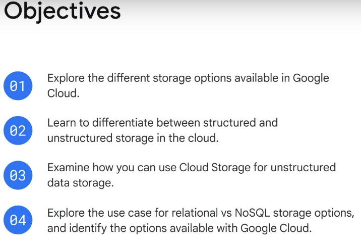

# Cloud Computing Fundamentals
## Course Introduction

## Module 4: Where do I store this stuff?
### 1. Storage options available in Google Cloud
Every application needs to store data, and requiere different storage database solutions.

#### Storage offerings
Google Cloud offers: relational and non-relational databases and worldwide object storage. It provides managed storage and database services that are scalable and reliable. Including:
- Cloud Storage
- Cloud SQL (Relational DB)
- Cloud Spanner (Relational DB)
- Firestore (NoSQL DB)
- Bigtable (NoSQL DB)
 
 #### Common cloud storage use cases
 - **Content storage and delivery:** Videos, images, etc. It's for files
 - **Data analytics and general compute:** Users can process or expose their data to analytics tools.
 - **Backup and archival storage:** Users can migrate infrequently accessed content to cheaper cloud storage options.
 
 #### For users with databases
 There are two options:
 1. Migrate existing databases to the cloud. Moving from MySQL to CloudSQL.
 2. Innovate, build or rebuild for the cloud.

### 2. Structured and unstructured data storage
#### Untructured data
Unstructured data is information stored in a non-tabular form such as documents, images, and audio files. This is best suited to Cloud Storage. This kind of data is more difficult to process since there is no internal identifier.
It often includes text and multimedia content, for example, email messages, documents, photos, videos, presentations, and web pages.

#### Structured data
It represents information stored in tables, rows, and columns. You can expect this type of data to be organized and clearly defined and usually easy to capture, access, and analyze.
It often includes names, addresses, contact numbers, dates, and billing info. And it also helps to be understood by programming languages and can be manipulated relatively quickly.

#### Choose the right option
Structured data comes in two types: transactional workloads and analytical workloads.
- Transactional workloads stem from Online Transaction Processing systems, which are used when fast data inserts and updates are required to build row-based records
  - Require standardized queries that affect only a few records.
  - **Cloud SQL, Cloud Spanner**
- Analytical workloads stem from Online Analytical Processing systems, which are used when entire datasets need to be read.
  - Complex queries.
  - **BigQuery,  Bigtable**

### 3. Unstructured Storage using Cloud Storage
Cloud Storage is a fully managed scalable service that has a wide variety of uses. Cloud Storage’s primary use is whenever **binary large-object storage** (also known as a **“BLOB”**) is needed.

#### What is Object Storage?
Object storage is a computer data storage architecture that manages data as “objects” and not as a file and folder hierarchy (file storage), or as chunks of a disk (block storage). These objects are stored in a packaged format that contains the binary form of the actual data itself, relevant associated metadata (such as date created, author, resource type, and permissions), and a globally unique identifier.
These unique keys are in the form of URLs, which means object storage interacts well with web technologies. 

#### Cloud Storage classes
- **Standard Storage:** For frequently accessed data (Hot data).
- **Nearline Storage:** For storing infrequently accessed data (Once per month).
- **Coldline Storage:** For reading or modifying data (Once every 90 days).
- **Archive Storage:** For data archiving, online backup, and dusaster reivery (Once every year)

The order listed goes from the most expensive to the cheapest one. All of them include:
- Unlimited storage.
- Worldwide accesibility and locations.
- Low latency and high durability.
- Uniform experience.
- Geo-redundancy.

#### Cloud Storage Objects
- They are organized into buckets.
- They are inmutable, so that means that when you edit an object, you are creating a new version of it.
- Administrators can either allow each new version to completely overwrite the older one or keep track of each change made to a particular object by enabling “versioning” within a bucket.
- Cloud Storage offers lifecycle management policies for your objects (Delete after *x* days).

### 4. Lab: Cloud Storage: Qwik Start - CLI/SDK

#### Create a bucket
1. In the Cloud Console, go to **Naviagtion menu > Cloud Storage > Buckets**. Click **CREATE BUCKET**
2. **Name your bucket:** Enter a unique name for your bucket.
3. Select your preferred configuration for your bucket.

#### Task 1. Upload an object into your bucket
You can use the `gsutil cp` command for uploading a file to your bucket:
`gsutil cp ada.jpg gs://YOUR-BUCKET-NAME`

#### Task 2. Download an object from your bucket
Use the `gsutil cp` command to download the image from your bucket:
``gsutil cp -r gs://YOUR-BUCKET-NAME/ada.jpg .`

#### Task 3. Copy an object to a folder in the bucket
Use the `gsutil cp` command to create a folder called `image-folder` and copy the image (ada.jpg) into it:
`gsutil cp gs://YOUR-BUCKET-NAME/ada.jpg gs://YOUR-BUCKET-NAME/image-folder/`

#### Task 4. List contents of a bucket or folder
Use the `gsutil ls` command to list the contents of the bucket:
``gsutil ls gs://YOUR-BUCKET-NAME`

#### Task 5. List details for an object
Use the `-l` flag to get some details:
`gsutil ls -l gs://YOUR-BUCKET-NAME/ada.jpg`

#### Task 6. Make your object publicly accessible
Use the `gsutil acl ch` command to grant all users read permission for the object stored in your bucket:
`gsutil acl ch -u AllUsers:R gs://YOUR-BUCKET-NAME/ada.jpg`

#### Task 7. Remove public access
Use the `gsutil acl ch` command in the enxt way:
`gsutil acl ch -d AllUsers gs://YOUR-BUCKET-NAME/ada.jpg`

P.D You can remove files from your bucket using `gsutil rm`.

### 5. SQL managed services
- **Database:** It's a collection of information organized sot hat it can easily be accessed and managed. We have apps that are able to write data in and read data out of databases.
Relational databases are the most common. 

### 6. Exploring Cloud SQL
Cloud SQL offers fully managed relational databases, including **MySQL, PostgreSQL, and SQL Server as a service**. It’s designed to hand off mundane, but necessary and often time-consuming, tasks to Google.

#### Advantages
- No software installation.
- Supports automatic replication scenarios.
- Supports managed backups.
- Includes a network firewall.

### 7. Lab: Cloud SQL for MySQL: Qwik Start

#### Task 1. Create a Cloud SQL instance
1. From the Navigation menu (Navigation menu icon) click on SQL.
2. Click **Create Instance**.
3. Select your preferences.
4. Clik **Create Instance**.

#### Task 2. Connect to your instance using the mysql client in Cloud Shell
1. At the Cloud Shell prompt, connect to your Cloud SQL instance by running the following:
``gcloud sql connect myinstance --user=root`
2. Enter your root password
You'll see the `mysql` prompt.

#### Task 3. Create a database and upload data
Basically here you are inside the MySQL manager, this means that you can create tables, insert data, make queries, etc.

### 8. Cloud Spanner as a managed service
Cloud Spanner is a fully managed relational database service that scales horizontally, is strongly consistent, and speaks SQL.

Cloud Spanner is especially suited for applications that require:
- An SQL relational database management system with joins and secondary indexes.
- Built-in high availability.
- Strong global consistency.
- Database sizes that exceed 2 TB.
- And high numbers of input/output operations per second, such as tens of thousands of reads/writes per second. 

#### How does it work?
Data is automatically and instantly copied across regions, which is called synchronous replication. As a result, queries always return consistent and ordered answers regardless of the region.

### 9. NoSQL managed services options
- Firestore
- Bigtable

### 10. Firestore, a NoSQL document store
Firestore is a flexible, horizontally scalable, NoSQL cloud database for mobile, web, and server development.
With Firestore, incoming data is stored in a document structure, and these documents are then organized into collections.

Firestore’s NoSQL queries can then be used to retrieve individual, specific documents or to retrieve all the documents in a collection that match your query parameters.

### 11. Bigtable as a NoSQL option
Bigtable is Google's NoSQL big data database service. It's the same database that powers many core Google services, including Search, Analytics

Great choice for:
- Operational applications.
- Analytical applications.

#### Why should you choose it?
- 1TB of semi-structured or structured data.
- Data is fast with high throughput.
- NoSQL data.
- Work with big data.
- Run machine learning algorithms on the data.

Using APIs, data can be read from and written to Bigtable through a data service layer like Managed VMs, the HBase REST Server, or a Java Server using the HBase client.
