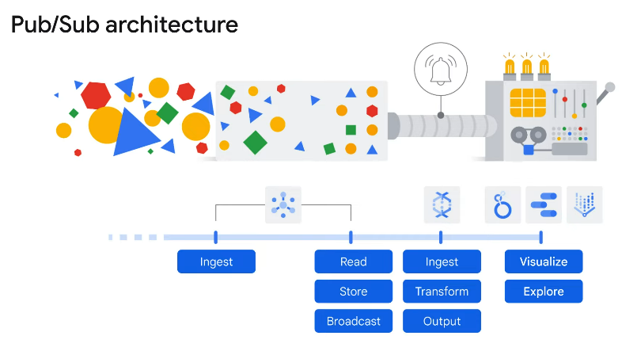

# Module 5: There's an API for that!

## 1. The purpose of APIs

### What is an API?
Application developers structure the software they write so that it presents a clean, well-defined interface that hides unnecessary detail, and then they document that interface. That's an application programming interface -API-.
The underlying implementation can change, as long as the interface doesn’t, and other pieces of software that use the API don’t have to know or care.

### Characteristics
- A clean, well-defined interface.
- Underlying implementation can change.
- Changes to the API are made with versions

### What is a REST API?
**REpresentational State Transfer**, or REST, is currently the most popular architectural style for services. It outlines a key set of constraints and agreements that a service must comply with.

- It uses HTTP requests to GET, PUT, POST and DELETE data.
- Designed to set up a format for applications to communicate.
- Great for cloud applications because they are stateless.
- Authentication via OAuth and security by leveraging tokens.

## 2. Cloud Endpoints
Cloud Endpoints is a distributed API management system that uses a distributed Extensible Service Proxy, which is a service proxy that runs in its own Docker container. 
- Distributed API management system.
- It provides an API Console, hosting, logging, monitoring, etc. (For your APIs)
- Use with any PIs that support the OpenAPI specification.
- Supports applications running in App Engine, Google Kubernetes Engine and Compute Engine.

### Deploy and manage APIs easily with Cloud Endpoints
- **Interface definition:** OpenAPI, gRPC API
- **Authentication and authorization: ** Service-to-service authentication. User authentication
- **Logging and monitoring:** Cloud Logging, Cloud Trace
- **Management and scalability:** Extensible Service, Proxy Service, Managment, Service Control.

## 3. Lab: Cloud Endpoints: Qwik Start

### Task 1. Getting the sample code
1. Enter the following command in Cloud Shell to get the sample API and scripts and go inside that directory:
``gsutil cp gs://spls/gsp164/endpoints-quickstart.zip .
unzip endpoints-quickstart.zip``


### Task 2. Deploying the Endpoints configuration
To publish a REST API to Endpoints, an OpenAPI configuration file that describes the API is required. The lab's sample API comes with a pre-configured OpenAPI file called `openapi.yaml`.
Endpoints uses `Google Service` Management, an infrastructure service of Google Cloud, to create and manage APIs and services. To use Endpoints to manage an API, you deploy the API's OpenAPI configuration to Service Management.
1. In the `endpoints-qwikstart` directory, enter the following:
`cd scripts`
2. Run the following script, which is included in the sample:
`./deploy_api.sh`

 #### What is the script doing?
 Cloud Endpoints uses the `host` field in the OpenAPI configuration file to identify the service. The `deploy_api.sh` script sets the ID of your Cloud project as part of the name configured in the `host` field. (When you prepare an OpenAPI configuration file for your own service, you will need to do this manually.)

The script then deploys the OpenAPI configuration to Service Management using the command: `gcloud endpoints services deploy openapi.yaml`

As it is creating and configuring the service, Service Management outputs some information to the console. You can safely ignore the warnings about the paths in `openapi.yaml` not requiring an API key. On successful completion, you see a line like the following that displays the service configuration ID and the service name


### Task 3. Deploying the API backend
To deploy the API backend, make sure you are in the `endpoints-quickstart/scripts` directory. Then, run the following script:
`./deploy_app.sh`

### Task 4. Sending requests to the API
After deploying the sample API, you can send requests to it by running the following script:
`./query_api.sh`
The script echoes the `curl` command that it uses to send a request to the API, and then displays the result. You'll see something like the following in Cloud Shell:

And for testing, run (You are sending an IATA airport code):
`./query_api.sh JFK`

### Task 5. Tracking API activity
With APIs deployed with Cloud Endpoints, you can monitor critical operations metrics in the Cloud Console and gain insight into your users and usage with Cloud Logging:

1. Run this traffic generation script:
`./generate_traffic.sh`
2. In the Console, go to **Navigation menu > Endpoints > Services** and click **Airport Codes** service to look at the activity graphs for your service.
- Click the **Overview** tab. Here you'll see the traffic coming in. After the traffic generation script has been running for a minute, scroll down to see the three lines on the **Total latency** graph (50th, 95th, and 99th percentiles). This data provides a quick estimate of response times.
- Click the **Deployment history** tab. This tab displays a history of your API deployments, including the deployment time and who deployed the change.
3. At the bottom of the Endpoints graphs, under Method, click the **View logs** link for GET/airportName. The Logs Viewer page displays the request logs for the API.

### Task 6. Add a quota to the API
1. Deploy the Endpoints configuration that has a quota:
`./deploy_api.sh ../openapi_with_ratelimit.yaml`
2. Redeploy your app to use the new Endpoints configuration:
`./deploy_app.sh`
3. In the Console, navigate to **Navigation menu > APIs & Services > Credentials**.
4. Click **Create credentials** and choose **API key**. A new API key is displayed on the screen. Save it
5. In Cloud Shell, type the following. Replace YOUR-API-KEY with the API key you just created:
`export API_KEY=YOUR-API-KEY`
6. Send your API a request using the API key variable you just created:
`./query_api_with_key.sh $API_KEY`
7. The API now has a limit of 5 requests per second. Run the following command to send traffic to the API and trigger the quota limit:`./generate_traffic_with_key.sh $API_KEY`
And stop the command in 10 seconds
8. For showing the excesive quota. Run another request and you'll see this:
`./query_api_with_key.sh $API_KEY`
```
{
     "code": 8,
     "message": "Insufficient tokens for quota 'airport_requests' and limit 'limit-on-airport-requests' of service 'example-project.appspot.com' for consumer 'api_key:AIzeSyDbdQdaSdhPMdiAuddd_FALbY7JevoMzAB'.",
     "details": [
      {
       "@type": "type.googleapis.com/google.rpc.DebugInfo",
       "stackEntries": [],
       "detail": "internal"
      }
     ]
    }
```

## 4. Apigee Edge
It's a different service from Cloud endpoinst since it has the next characteristics:
- Specific focus on business problems, like rating limiting, quotas, and analytics.
- Many Apigee Edge users provide a software service to other compaines.
- Backend services for Apigee Edge **don't need** to be in Google Cloud.

It helps to peel off its services individually


## 5. Pub/Sub
The Google Cloud Pub/Sub service allows applications to exchange messages reliably, quickly, and asynchronously. To accomplish this, a data producer publishes messages to a Cloud Pub/Sub topic. A subscriber client then creates a subscription to that topic and consumes messages from the subscription. Cloud Pub/Sub persists messages that could not be delivered reliably for up to seven days.

- **Data ingestion:** It's when stream, large data are received. It comes from thousand events that are happening at the same time (Ex. IoT). 

The name of Pub/Sub is short for Publisher/Suscriber
- It Publish messages to suscribers.
- Handle distributed message-oriented architectures at scale.

### Architecture


### Topics
Topics is a named resource to which messages are sent by publishers. Topics and suscribers are decoupled (It works like a radio antena).

## 6. Lab: Pub/Sub: Qwik Start - Python
### Task 1. Create a virtual environment
Python virtual environments are used to isolate package installation from the system.
1. Install the virtualenv environment:
`sudo apt-get install -y virtualenv`

2. Build the virutal environment:
`python3 -m venv venv`

3. Activate the virtual environment:
`source venv/bin/activate`

### Task 2. Install the client library
1. Install the client library:
`pip install --upgrade google-cloud-pubsub`

2. Get the sample code and go to the directory of it:
`git clone https://github.com/googleapis/python-pubsub.git`

### Task 3. Pub/Sub - the Basics
Google Cloud Pub/Sub is an asynchronous global messaging service. There are three terms in Pub/Sub that appear often: topics, publishing, and subscribing.

A topic is a shared string that allows applications to connect with one another through a common thread.

Publishers push (or publish) a message to a Cloud Pub/Sub topic. Subscribers will then make a subscription to that thread, where they will either pull messages from the topic or configure webhooks for push subscriptions. Every subscriber must acknowledge each message within a configurable window of time.

### Task 4. Create a topic
1. In Cloud Shell, your Project ID should automatically be stored in the environment variable GOOGLE_CLOUD_PROJECT:
`echo $GOOGLE_CLOUD_PROJECT`
`publisher.py` is a script that demonstrates how to perform basic operations on topics with the Cloud Pub/Sub API.

2. Run the publisher script to create Pub/Sub Topic:
`python publisher.py $GOOGLE_CLOUD_PROJECT create MyTopic`

3. This command returns a list of all Pub/Sub topics in a given project:
`python publisher.py $GOOGLE_CLOUD_PROJECT list`

You can also see your topic naviating to **Navigation menu > Pub/Sub > Topics**


### Task 5. Create a subscription
1. Create a Pub/Sub subscription for topic with `subscriber.py` script:
`python subscriber.py $GOOGLE_CLOUD_PROJECT create MyTopic MySub`

2. This command returns a list of subscribers in given project:
`python subscriber.py $GOOGLE_CLOUD_PROJECT list-in-project`

### Task 6. Publish messages
1. Publish the message "Hello" to `MyTopic`:
`gcloud pubsub topics publish MyTopic --message "Hello"`


### Task 7. View messages
Use MySub to pull the message from MyTopic:
```
python subscriber.py $GOOGLE_CLOUD_PROJECT receive MySub
```


###


