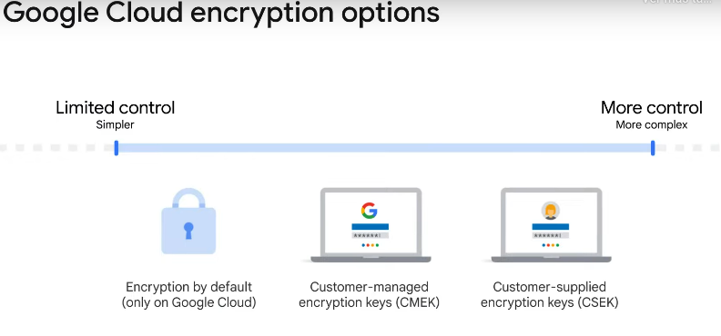
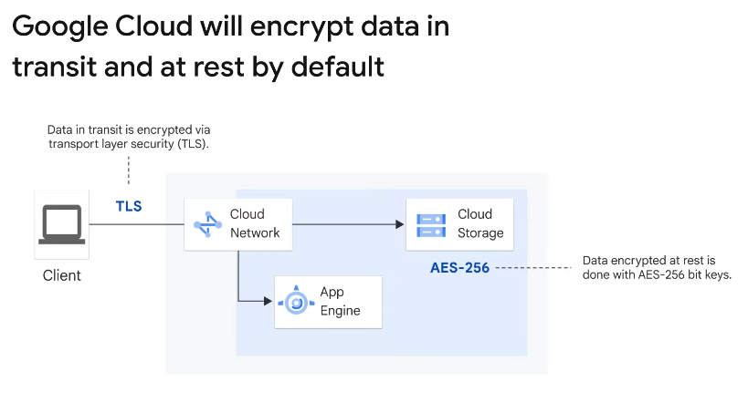

# Module 6: You can't secure the cloud, right?

## 1. Security in the cloud
### Infrastructure security design
- Operational security
- Internet communication
- Storage services
- Service deployment
- Hardware infrastructure

### Hardware infrastructure layer
#### Hardware design and provenance
Both the server boards and the networking equipment in Google data centers are custom designed by Google. Google also designs custom chips, including a hardware security chip that's currently being deployed on both servers and peripherals.

#### Secure boot stack
Google server machines use various technologies to ensure that they are booting the correct software stack, such as cryptographic signatures over the BIOS, bootloader, kernel, and base operating system image.

#### Premises security 
Google designs and builds its own data centers, which incorporate multiple layers of physical security protections.

Google also hosts some servers in third-party data centers, where we ensure that there are Google-controlled physical security measures on top of the security layers provided by the data center operator.

### Deployment layer
#### Encryption of inter-service operator
Google’s infrastructure provides cryptographic privacy and integrity for remote procedure call (“RPC”) data on the network.

#### User identity
Google’s central identity service, which usually manifests to end users as the Google login page, goes beyond asking for a simple username and password.

### Storage services layer
#### Encryption at rest
Most applications at Google access physical storage (in other words, “file storage”) indirectly by using storage services, and encryption (using centrally managed keys) is applied at the layer of these storage services. 

### Internet communication layer
#### Google Front End (GFE)
Google services that want to make themselves available on the internet register themselves with an infrastructure service called the Google Front End, which ensures that all TLS connections are ended using a public-private key pair and an X.509 certificate from a Certified Authority (CA).

#### Denial of Service ("DoS") protection
The sheer scale of its infrastructure enables Google to simply absorb many DoS attacks. Google also has multi-tier, multi-layer DoS protections that further reduce the risk of any DoS impact on a service running behind a GFE.

### Google operational security layer
#### Intrustion detection
Rules and machine intelligence give Google’s operational security teams warnings of possible incidents.

#### Reducing insider risk
Google aggressively limits and actively monitors the activities of employees who have been granted administrative access to the infrastructure.

#### Employee U2F use
To guard against phishing attacks against Google employees, employee accounts require use of U2F-compatible security keys.

#### Software development practices
Google employs central source control and requires two-party review of new code. Google also provides its developers with libraries that prevent them from introducing certain classes of security bugs. Google also runs a Vulnerability Rewards Program where we pay anyone who can discover and inform bugs in the infrastructure. 

> (Note from the author: I'm just shocked with the last sencence **:o**)
> (Note from the author after visiting the website: Really? Just 30.000? I bet an exploit would cost more in the dark web ewe).

##  2. The shared security model
Security responsibilities are shared between the customer and Google Cloud.
Google provides tools like the resource hierarchy and IAM to help them define and implement policies, but ultimately this part is their responsibility. Data access is usually the customer’s responsibility. They control who or what has access to their data. Google Cloud provides tools that help them control this access, such as Identity and Access Management, but they must be properly configured to protect data. 

## 3. Encryption options

It also exists a fourth option: To encrypt data locally before you store it the cloud (Client-side encryption)


### Customer-managed encryption keys (CMEK)
- Manage keys in a cloud-hosted solution.
- Encrypt and decrypt via API.
- Automated and at-will key rotation.
- Symmtric and asymmetric key suport.

### Customer-supplied encryption keys (CSEK)
- Customer-supplied encryption keys give users more control over their keys, but with greater management complexity.
- With CSEK, users use their own AES 256-bit encryption keys.
- Users are responsible for storing the keys and providing them as part of Google Cloud API calls.
- Google Cloud will use the provided key to encrypt the data before saving it.  

## 4. Authentication and authorization with IAM
With IAM, administrators can apply policies that define who can do what on which resources. The “who” part of an IAM policy can be a Google Account, a Google group, a service account, or Cloud Identity domain. The “can do what” part of an IAM policy is defined by a role.

 ### IAM role
 An IAM role is a collection of permissions. For example, to manage virtual machine instances in a project, you need to create, delete, start, stop, and change virtual machines. So these permissions are grouped into a role to make them easier to understand and manage.

 #### Cloud Identity
 With a tool called Cloud Identity, organizations can define policies and manage their users and groups by using the Google Admin console.
 - Admins can log in and manage Google Cloud resources by using the same usernames and passwords they already use in existing Active Directory or LDAP systems.

#### Basic IAM role
Basic roles are broad in scope. When applied to a Google Cloud project, they affect all resources in that project. Basic roles include owner, editor, viewer, and billing administrator.

#### Predefined roles
Specific Google Cloud services offer sets of predefined roles, and they even define where those roles can be applied.

#### Custom role
Custom roles with custom permissions.

#### Service accounts
Service accounts are named with an email address, but instead of passwords, they use cryptographic keys to access resources.

## 5. Lab: User Authentication: Identity-Aware Proxy
Identity-Aware Proxy, or IAP, is a resource that can be used to set up authentication to https-based applications without the use of VPNs. In this section of the course, you’ll use IAP to set up user authentication.

IAP lets you establish a central authorization layer for applications over TLS, so you can use an application-level access control model instead of relying on network-level firewalls. 

Only users and groups can access applications and resources protected by IAP through the proxy with the correct IAM role. The proxy provides a layer of protection between the outside world and an internal service. 

---

### Task 1. Deploy the application and protect it with IAP
This is an App Engine Standard application written in Python that simply displays a "Hello, World" welcome page. We will deploy and test it, then restrict access to it using IAP.

#### Review the application code
- Change from the main project folder to the 1-HelloWorld subfolder that contains code for this step:
`cd 1-HelloWorld`
The application code is in the `main.py` file. It uses the Flask web framework to respond to web requests with the contents of a template. That template file is in `templates/index.html`, and for this step contains only plain HTML. A second template file contains a skeletal example privacy policy in `templates/privacy.html`.

#### Deploy to App Engine
1. Deploy the app to the App Engine Standard environment for Python:
`gcloud app deploy`
2. Continue the steps.
3. Enter: `gcloud app brose`. You'll open a website saying *"Hello World"*.

#### Restrict access with IAP
1. In the cloud console window, click the Navigation menu **Navigation menu icon > Security > Identity-Aware Proxy**.
2. Click **ENABLE API**.
3. Click **GO TO IDENTITY-AWARE PROXY**.
4. Click **CONFIGURE CONSENT SCREEN**.
5. Select **Internal** under User Type and click **Create**.
6. Fill in the required blanks with appropriate values
7. **SAVE AND CONTINUE**
8. Complete **Scopes** and **Summary** H¿how you need it :3
9. Run this comman to disable the Flex API:
`gcloud services disable appengineflex.googleapis.com`
10. Return to the Identity-Aware Proxy page and refresh it. You should now see a list of resources you can protect. Click the toggle button in the IAP column in the **App Engine app** row to turn **IAP** on.
11. The domain will be protected by IAP. Click **TURN ON**.

#### Test that IAP is turned on
1. Open a browser tab and navigate to the URL for your app. A Sign in with Google screen opens and requires you to log in to access the app.

##### How to tell IAP which accounts to allow
1. Return to the Identity-Aware Proxy page of the console, select the checkbox next to App Engine app, and see the App Engine sidebar to the right.
> Each email address (or Google Group address, or Workspace domain name) that should be allowed access needs to be added as a Member.
2. Click **ADD PRINCIPAL**.
3. Enter the email accounts you need to give permissions.
4. Then, pick the **Cloud IAP > IAP-Secured Web App User** role to assign to that address.
5. **SAVE**.

There are two other files: requirements.txt lists all the non-default Python libraries the application uses, and app.yaml tells Google Cloud that this is a Python App Engine application.

### Task 2. Access user identity information
Once an app is protected with IAP, it can use the identity information that IAP provides in the web request headers it passes through. In this step, the application will get the logged-in user's email address and a persistent unique user ID assigned by the Google Identity Service to that user.
- Change directory:
`cd ~/user-authentication-with-iap/2-HelloUser`

#### Examine the application files
This folder contains the same set of files as seen in the previous app you deployed, 1-HelloWorld, but two of the files have been changed: main.py and templates/index.html. The program has been changed to retrieve the user information that IAP provides in request headers, and the template now displays that data.

There are two lines in main.py that get the IAP-provided identity data:

```
user_email = request.headers.get('X-Goog-Authenticated-User-Email')
user_id = request.headers.get('X-Goog-Authenticated-User-ID')
```

The **X-Goog-Authenticated-User-** headers are provided by IAP, and the names are case-insensitive, so they could be given in all lower or all upper case if preferred. The render_template statement now includes those values so they can be displayed:
``page = render_template('index.html', email=user_email, id=user_id)``

#### Test the updated IAP
Just go to the website.

#### Turn off IAP
Anyone can send web rquests that appeared to have passed throug IAP, for example:
`curl -X GET <your-url-here> -H "X-Goog-Authenticated-User-Email: totally fake email"`


### Task 3. Use Cryptographic Verification
If there is a risk of IAP being turned off or bypassed, your app can check to make sure the identity information it receives is valid. This uses a third web request header added by IAP, called ``X-Goog-IAP-JWT-Assertion``. The value of the header is a cryptographically signed object that also contains the user identity data. Your application can verify the digital signature and use the data provided in this object to be certain that it was provided by IAP without alteration.

Digital signature verification requires several extra steps. You can decide whether your application needs these extra steps based on the risk that someone might be able to turn off or bypass IAP, and the sensitivity of the application.

- Change your current directory:
`cd ~/user-authentication-with-iap/3-HelloVerifiedUser`

#### Deploy to App Engine
1. Deploy the app to the App Engine:
`gcloud app deploy`

#### Examine the application files
- The new functionality is primarly in the `user()` function:
```
def user():
    assertion = request.headers.get('X-Goog-IAP-JWT-Assertion')
    if assertion is None:
        return None, None
    info = jwt.decode(
        assertion,
        keys(),
        algorithms=['ES256'],
        audience=audience()
    )
    return info['email'], info['sub']
```

The `assertion` is the cryptographically signed data provided in the specified request header. The code uses a library to validate and decode that data. Validation uses the public keys that Google provides for checking data it signs, and knowing the audience that the data was prepared for (essentially, the Google Cloud project that is being protected). Helper functions `keys()` and `audience()` gather and return those values.

The signed object has two pieces of data we need: the verified email address, and the unique ID value (provided in the `sub`, for subscriber, standard field).


## 6. IAM authorization best practies
### Leverage and understand the resource hierarchy
- Use projects to group resources.
- Check the policy granted on each resource.
- - Check inheritance of the resources.
- Use "principle of least privilege".
- Audit policies using Cloud Audit Logs.
- Audit memberships of groups used in policies.
- Granting roles to groups instead of individuals.

### Best practices
- Use cautin when granting the `serviceAccountUser` role.
- Give a service account a display name that clearly identifies its purpose.
- Establish a naming convention for service accounts.
- Establish key rotation policies and methods.

## 7. Lab: IAM: Qwik Start
### The IAM console and project level roles
> You can see roles in **Navigation menu > IAM & Admin > IAM**
There are four roles (Primitive roles):
- Browser
- Editor
- Owner
- Viewer

|**Role Name**|**Permissions**|
|-------------|---------------|
|Viewer|Permissions for read-only actions that do not affect state, such as viewing (but not modifying) existing resources or data.|
|Editor|All viewer permissions, plus permissions for actions that modify state, such as changing existing resources.|
|Owner|Manage roles and permissions for a project and all resources within the project, and Set up billing for a project.|
|Browser|Read access to browse the hierarchy for a project, including the folder, organization, and Cloud IAM policy. This role doesn't include permission to view resources in the project.|

### Explore editor roles
If you are a viewer, you can't give roles.

### Prepare a resource for access testing
Here basically you create a bucket and upload a file.

### Verify project viewer access
The "Viewer" user should see the bucket, since he has allowed read-only acctions

### Remove project access
1. Go to **Navigation menu > IAM & Admin > IAM** and the pencil icon inline and to the right of the respective user.
2. Remove Project Viewer access for the user by clicking the trashcan icon next to the role name. Then click **SAVE**.

### Verify that the user has lost access
> You just are veryfing what you did in the last section ewe.

### Add Storage permissions
1. Copy the username from the user from the **Lab Connection** panel.
2. Go to **Navigation menu > IAM & Admin > IAM**.
3. Click **+GRANT ACCESS** button and paste the username into the **New principals** field.
4. In the **Select a role** field, select **Cloud Storage > Storage Object Viewer** from the drop-down menu.
5. **SAVE**.
