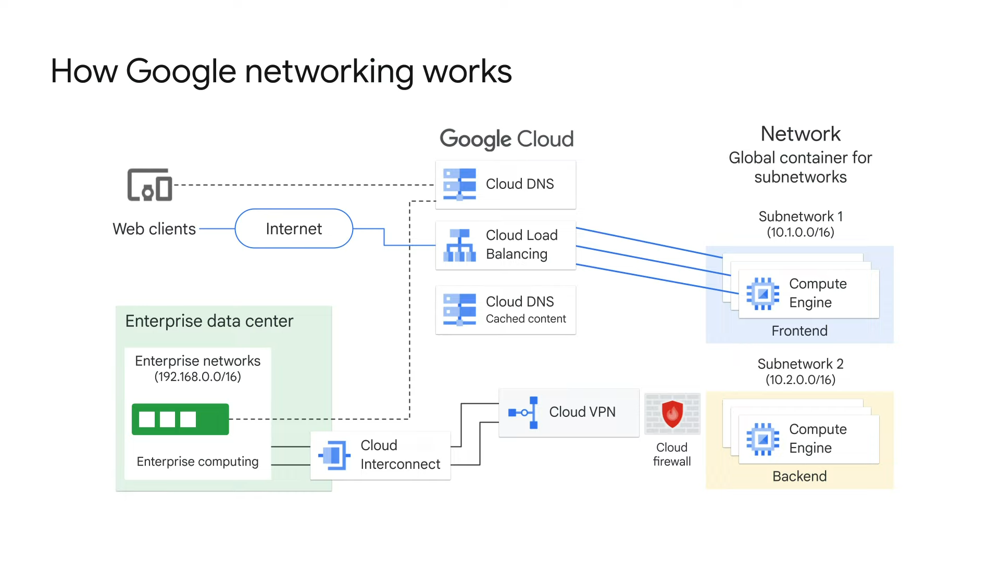
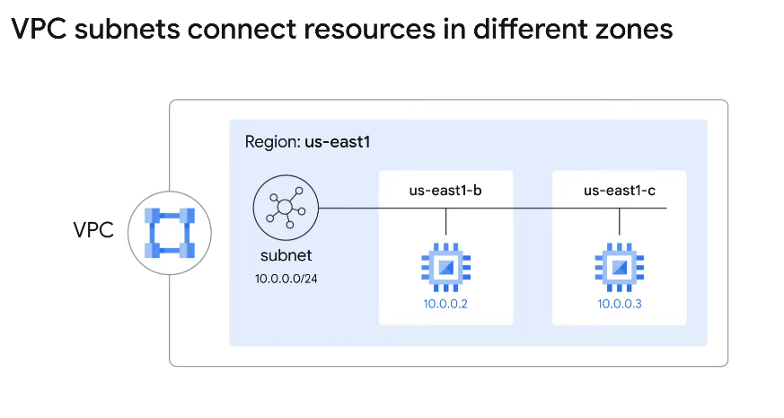
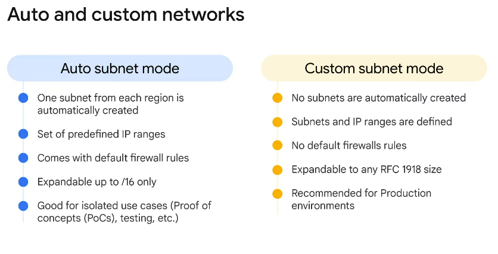
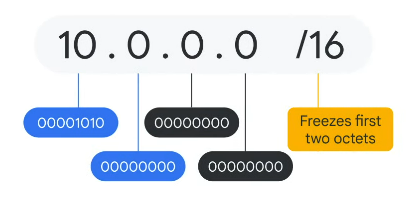

# Module 7: it helps to network

## 1. Security in the cloud
In Google Cloud, a "network" is an isolated global resource holding network configuration. Instances are deployed in regional subnetworks, however the policy (firewall, routing, and so on), and access through VPN, are configured at the global network level.

### How Google networking works
Here's an example network diagram for an application that bridges an organization's physical data center
  
In this example, the subnetworks are configured so that the frontend subnet cannot talk directly to the data center or colocation facility.

## 2. Virtual Private Clouds (VPCs)
A Virtual Private Cloud, or VPC, is a secure, individual, private cloud-computing model hosted within a public cloud.

On a VPC, customers can run code, store data, host websites, and do anything else they could do in an ordinary private cloud, but this private cloud is hosted remotely by a public cloud provider. This means that VPCs combine the scalability and convenience of public cloud computing with the data isolation of private cloud computing. 

### Virtual Private Cloud Option
- VPC networks connect Google Cloud resources to each other and to the internet. 
- - Segmenting networks.
- - Using firewall rules to restrict access to instances.
- - Creating static routes to forward traffic to specific destinations.
- Google VPC networks are global and can have subnets in any Google Cloud region worldwide.

### VPC subnets connect resources in different zones
  

### Auto and custom networks
  
> You can't switch a network from custom mode to auto mode.

## 3. The basics of public and internal IP addresses

### A VPC is made up of subnets
  
- A Virtual Private Cloud (VPC) is composed of subnetworks, or subnets, and each subnet must be configured with a private IP CIDR (*Classless Inter-domain Routing*) address. 
- The CIDR range will determine what internal IP addresses will be used by virtual machines in the subnet. 
- **Internal IP addresses are only used for communication within the VPC** and cannot be routed to the internet. 
- Each octet in an IP address is represented by 8 binary bits. So a typical IPV4 address is 32-bits long. The number at the end of the range determines how many bits will be static or frozen. This number determines how many IP addresses are available with a CIDR address.
- The CIDR range determines how many IP addresses are available. A /16 range will provide 65,536 available IP addresses. Every time you add “1” to the last number, the number of available IP addresses is cut in half.

### The basics of public and Internal IP addresses.
#### Public (external) IP addresses
- Can be assigned from pool or reserved.
- Billed when not atttached to a running VM.
- VM doesn't know the external IP; it's mapped to the internal IP.

#### Private (internal) IP addresses
- Alloccated from subnet range to VMs by DHCP.
- DHCP lease is renewed every 24 hours.
- VM name and IP is registered with network-scoped DNS service.

## 4. The Google Cloud network

### Google Cloud's primary networking products
- **Google Cloud VPC:** Comprehensive networking capabilites and infraestructure.
- - You can connect your google cloud resources to a VPC and isolate them.
- **Cloud Load Balancing:** High performance, scalable load balancing
- **Cloud CDN:** Low-latency, low-cost content delivery.
- - *Content Delivery Network*.
- - Storing files close to the user.
- **Cloud Interconnect:** Fast, high availibility interconnect.
- - Connecting your own infrastructure to Google's global cable.
- **Cloud DNS:** Highly available global DNS network.
- - *Domain Name System*.
- - It translates requests for domain names into IP addresses.

## 5. Routes and firewalls rules in the cloud
### Routing table
- VPCs have routing tables.
- - **Routing table:** Data table of router locations and their IP addresses stored in the memory of a router or a network host.
- VPCs routing tables are built-in.
- They are used to forward travvig from one instance to another within the same networs, subnetworks, etcc

### Firewall
- It's provided by Google Cloud.
- It restricts access to instances through both incoming and outgoing traffic.
- Rules can be defined through metadata tags (Ex: Tag on "WEB" tag) on Compute Engine instances.

## 6. Multiple VPC networks

### VPC peering
- It allows projects to communicate (exhange traffic).
- It's decentralized or distributed approach to multi-project networking, because each VPC network can remain under the control of separate administrator groups and mantain its own global firewall and routing tables.

### Shared VPC
- You are using here IAM for controling who and what in one project can interact with a VPC.
- It allows organizations to connect resources from multiple projects to a common VPC network.
- Resources to communicate with each other securely and efficiently by using internal IPs from that network.
- **Name:** Shared VPC network.

## 7. Lab: Multiple VPC newtorks

## 8. Lab VPC Networks - Controlling Access

## 9. Buidling hybrid clouds

## 10. Load balancing options

## 11. Lab: HTTP Load Balancer with Google Cloud Armor

